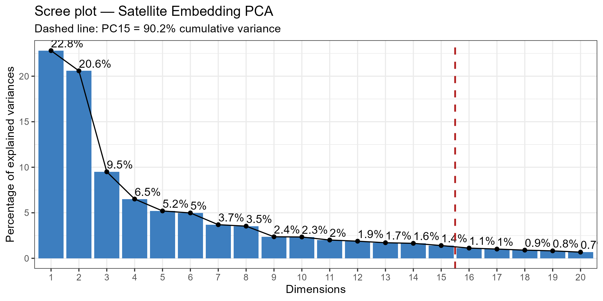
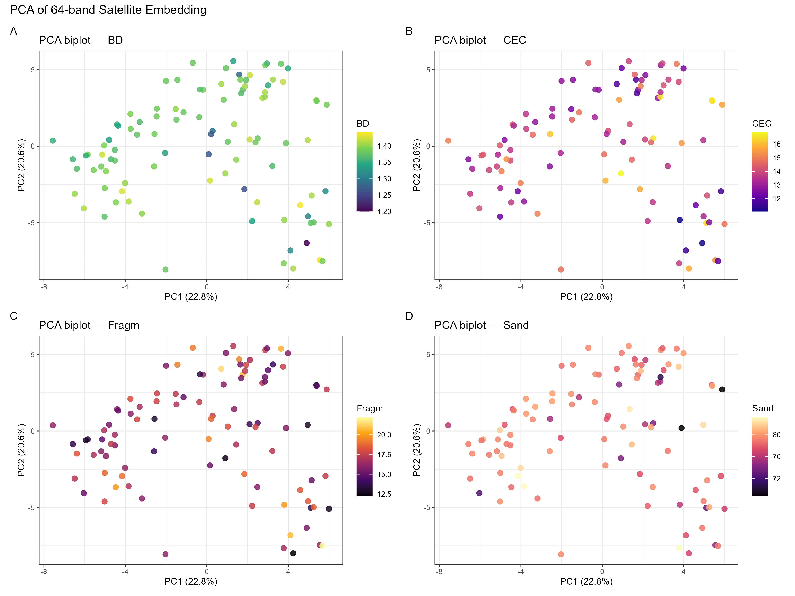
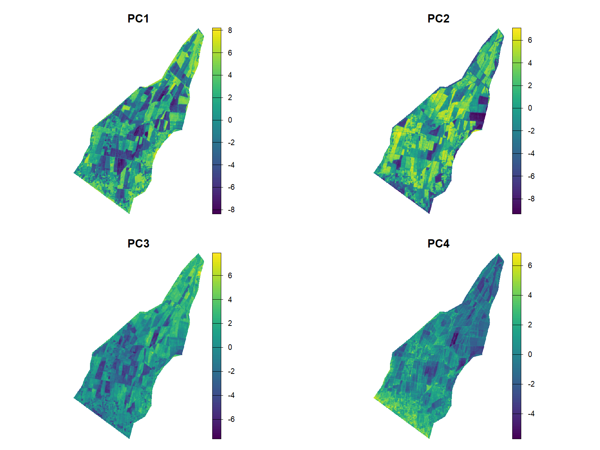
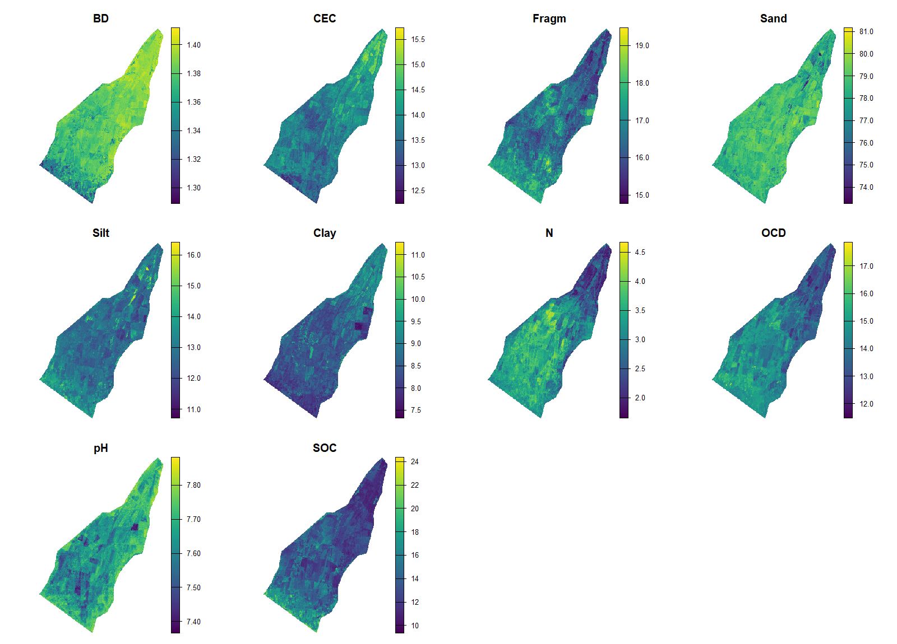

# DSM with Satellite Embeddings

Digital Soil Mapping (DSM) of 10 soil properties using Google's 64-band satellite embedding dataset (`GOOGLE/SATELLITE_EMBEDDING/V1/ANNUAL`) as covariates, reduced via PCA and modelled with Random Forest.

## Overview

This workflow downloads a pre-computed satellite embedding raster from Google Earth Engine, extracts the embedding values at soil profile locations, reduces the 64 bands to a compact set of principal components, and fits cross-validated Random Forest models to predict soil properties across the landscape.

**Study area:** Trujillo region, Peru (UTM Zone 17S, EPSG:32717)
**Target year:** 2024
**Soil depth:** 15–30 cm (SoilGrids 250 m)

## Workflow

```
01_download_raster.js   →   02_R_extract_and_pca.R   →   03_R_spatial_prediction.R
      (GEE)                          (R)                           (R)
```

### Script 01 — Download embedding raster (Google Earth Engine)

Loads the `GOOGLE/SATELLITE_EMBEDDING/V1/ANNUAL` image collection, filters to the study area and target year, mosaics the tiles, clips to the boundary, and exports a 64-band Cloud-Optimised GeoTIFF to Google Drive.

**Configure before running:**
| Parameter | Default | Description |
|-----------|---------|-------------|
| `boundaryAsset` | `projects/ee-cmcarbajal/assets/border_trujillo` | GEE asset path for study area boundary |
| `year` | `2024` | Target year (2017–2025) |
| `crs` | `EPSG:32717` | Output CRS |
| `scale` | `10` | Export resolution in metres |
| `driveFolder` | `DSM_embeddings` | Google Drive output folder |

**Output:** `embedding_raster_<year>.tif` (64 bands: A00–A63) in Google Drive.

---

### Script 02 — Extract embeddings & PCA (R)

1. Extracts 64-band embedding values at each soil profile location
2. Runs PCA on the embedding matrix (auto-selects PCs explaining ≥ 90% cumulative variance)
3. Generates exploratory figures (scree plot, biplots, UMAP, PC–soil correlation heatmap)
4. Projects the PCA model onto the full raster grid and saves `embedding_pca.tif`

**Key output:** 15 PCs retained (90.2% cumulative variance)

---

### Script 03 — Spatial prediction with Random Forest (R)

1. Loads PCA workspace from Script 02
2. Fits RF models (via `ranger`) for each soil property using repeated k-fold CV (5-fold × 3 repeats)
3. Extracts variable importance and plots observed vs predicted
4. Re-fits final models with `randomForest` (pure R, avoids `ranger`/Rcpp serialisation issues) and predicts across the raster domain
5. Saves a 10-band prediction raster `soil_predictions.tif`

**RF hyperparameters:**
| Parameter | Value |
|-----------|-------|
| Trees | 500 |
| mtry fraction | 1/3 of PCs |
| Min node size | 5 |
| CV folds × repeats | 5 × 3 |

## Predicted Soil Properties

| Variable | Description |
|----------|-------------|
| BD | Bulk density (g/cm³) |
| CEC | Cation exchange capacity (cmol/kg) |
| Fragm | Coarse fragments (%) |
| Sand | Sand content (%) |
| Silt | Silt content (%) |
| Clay | Clay content (%) |
| N | Total nitrogen (g/kg) |
| OCD | Organic carbon density (kg/m³) |
| pH | Soil pH (H₂O) |
| SOC | Soil organic carbon (g/kg) |

## Repository Structure

```
dsm_embeddings/
├── 01_download_raster.js          # GEE script — export embedding raster
├── 02_R_extract_and_pca.R         # R — extract values, PCA, UMAP
├── 03_R_spatial_prediction.R      # R — RF modelling, spatial prediction
│
├── data/
│   ├── agro_geo.gpkg              # Study area boundary (GeoPackage)
│   ├── soilgrids_250m/
│   │   ├── soilgrids_at_points.csv        # Soil properties at profile locations
│   │   ├── soilgrids_stack_utm.tif        # SoilGrids raster stack (UTM)
│   │   └── soilgrids_<property>_15-30cm.tif  # Individual SoilGrids bands
│   ├── soilgrids_with_embeddings.csv      # Soil data + extracted embedding values
│   ├── embedding_pca.tif          # PCA raster (n_pcs bands) [gitignored]
│   ├── embedding_raster_2024.tif  # Raw 64-band embedding raster [gitignored]
│   ├── pca_workspace.RData        # PCA objects for Script 03
│   └── rf_workspace.RData         # RF models and results
│
├── outputs/
│   ├── rf_cv_results.csv          # Cross-validated RMSE, MAE, R² per property
│   └── rf_importance.csv          # Variable importance per property × PC
│
└── figures/
    ├── 01_scree_plot.png           # PCA variance explained
    ├── 02_biplots.png              # PC1 vs PC2 coloured by soil properties
    ├── 03_pc_soil_correlation.png  # Spearman ρ heatmap: PCs × soil properties
    ├── 04_umap.png                 # UMAP of 64-band embedding space
    ├── 05_pca_raster_maps.png      # Spatial maps of first 4 PCs
    ├── 06_rf_obs_pred.png          # Observed vs predicted (CV) per property
    ├── 07_rf_importance.png        # RF variable importance heatmap
    └── 08_soil_prediction_maps.png # Final soil prediction maps
```

## R Dependencies

Scripts 02 and 03 auto-install any missing packages on first run.

| Package | Purpose |
|---------|---------|
| `terra` | Raster and vector operations |
| `sf` | Vector geometry and CRS handling |
| `tidyverse` | Data wrangling and ggplot2 |
| `factoextra` | PCA visualisation helpers |
| `umap` | UMAP non-linear dimensionality reduction |
| `ranger` | Fast Random Forest (cross-validation) |
| `randomForest` | RF for spatial prediction (serialisation-safe) |
| `caret` | Cross-validation helpers |
| `viridis` | Colour palettes |
| `patchwork` | Multi-panel plot composition |
| `tidyterra` | ggplot2 + terra integration |

## Outputs

### Figures

| Figure | Description |
|--------|-------------|
|  | 15 PCs explain 90.2% of embedding variance |
|  | PC space coloured by BD, CEC, Fragm, Sand |
|  | Spatial structure of first 4 PCs |
|  | Predicted maps for all 10 soil properties |

### Key files

- `data/soil_predictions.tif` — 10-band GeoTIFF with one layer per soil property
- `outputs/rf_cv_results.csv` — RMSE, MAE, R² for each property from repeated CV

## Quick Start

1. **Run Script 01** in the [Google Earth Engine Code Editor](https://code.earthengine.google.com/), submit the export task from the Tasks panel, and download the resulting GeoTIFF to `data/`.

2. **Run Script 02** in R from the project root:
   ```r
   source("02_R_extract_and_pca.R")
   ```

3. **Run Script 03** in R:
   ```r
   source("03_R_spatial_prediction.R")
   ```

> All paths are relative to the project root. Set your working directory to the repo root before running R scripts.

## Notes

- Large raster files (`embedding_raster_2024.tif`, `embedding_pca.tif`) are excluded from version control via `.gitignore` (> 100 MB).
- Script 03 uses `randomForest` (not `ranger`) for pixel-level prediction to avoid Rcpp external pointer issues that arise when predicting over large rasters after serialisation.
- The embedding dataset covers years 2017–2025. Change `CONFIG.year` in Script 01 to use a different year.
